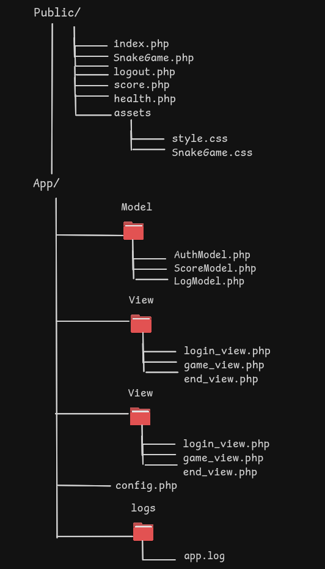

# Contexte


# Structure

.


# Mesures

## Mesures d'accessibilité

## Mesures de sécurité


### Technologies et fonctionnement

Le jeu est écrit en JS et tourne entièrement dans le navigateur.
La partie back-end est codée en langage PHP, pour les fonctionnalités de gérer le score, vérifier le mot de passe, la connexion, détruire la session et garder en écrit les événements

Installer PHP en local sur Linux (Ubuntu)
« sudo apt update »
sudo apt install php

Vérifie que ça marche : 
```

Voici un bloc de code.

```
php -v

Démarrer le serveur local depuis le dossier projet :
cd game_app/public

Ouvrir dans le navigateur
php -S localhost:8000
http://localhost:8000

mkdir logs
touch logs/app.log
chmod 664 logs/app.log   # PHP doit pouvoir écrire dedans


### Améliorations

### sources

https://www.how2lab.com/programming/php/mvc-beginner-guide
